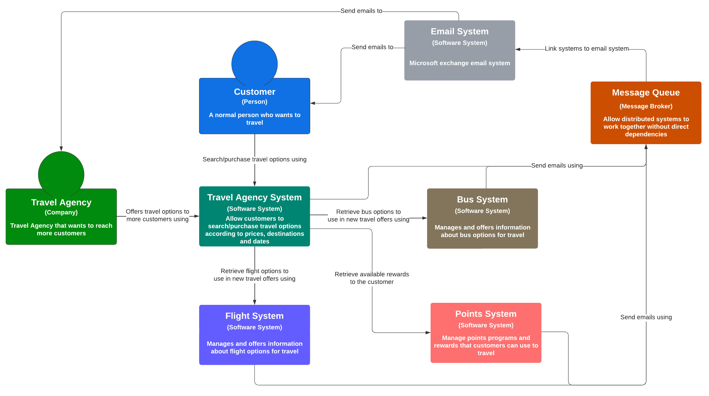

# Travel Agency Ports and Adapters Application

This project aims to make a simulation of a Travel Agency application, built on Ports and Adapters architecture using NestJs.

## Why Ports and Adapters?

I believe that makes sense try this architecture because the core system needs communication with another 4 systems:
    1. Bus System, to get bus trip options and stuff.
    2. Flight System, to get flight travel options and stuff.
    3. Points/Rewards/Miles system, to get fidelity/points programs options to pay with discount for travel.
    4. Message broker, to send emails and emit the tickets for customers.

According to the C4 System Content Diagram below:

